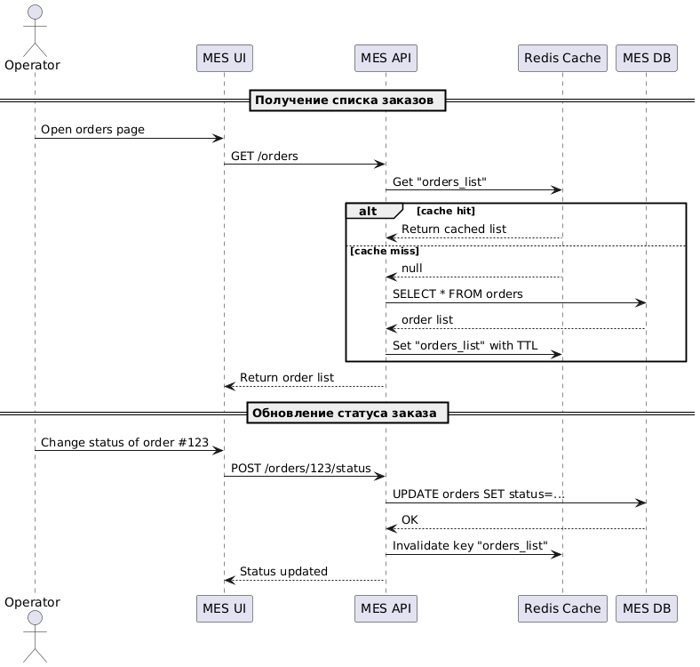

# Задание 5

## Анализ системы и выбор области кеширования
**Проблемные точки:**
- Частые GET-запросы к MES API для получения списка заказов.
- Высокая нагрузка на БД.
- Интерфейс оператора долго загружает данные.
- Время обработки заказов влияет на общее впечатление клиента.

**Кандидаты на кеширование:**
- Список заказов (для оператора и API пользователей).
- Данные по конкретному заказу (детали, история).
- Расчёт стоимости заказа (если параметры не меняются).

## Мотивация
**Технические цели:**
- Уменьшить нагрузку на MES DB.
- Повысить скорость ответа от MES API.
- Снизить время генерации страницы MES-интерфейса.

**Бизнес-эффект:**
- Быстрая работа MES → выше производительность операторов.
- Снижение времени выполнения заказа.
- Повышение удовлетворённости клиентов и снижение оттока.

## Предлагаемое решение
**Тип кеша:**
Серверное кеширование подходит лучше, т.к. кеш должен использоваться множеством клиентов (операторов, API-пользователей) и хранить общее состояние (списки заказов и статусы).

**Паттерн кеширования:**
Cache-Aside

**Почему именно он:**
- Прост в реализации.
- Не мешает писать напрямую в БД.
- Позволяет использовать данные только по необходимости.

**Почему не Write-Through:** создаёт избыточную запись в кеш на каждую запись в БД (неэффективно при большом потоке одноразовых изменений).
**Почему не Refresh-Ahead:** сложно прогнозировать, когда данные понадобятся, и заранее обновлять.

### Стратегия инвалидации кеша

**Выбор стратегии: Инвалидация по ключу**
- После изменения заказа (POST/PUT) кеш с ключом orders_list сбрасывается.
- Кеш по отдельному заказу (order_123) можно сбрасывать точечно.

**Почему не временная (TTL-only)?**
- Если заказы меняются вручную, TTL может быть слишком длинным → пользователь увидит устаревшие данные.
- Если TTL слишком короткий — потеря смысла кеша.